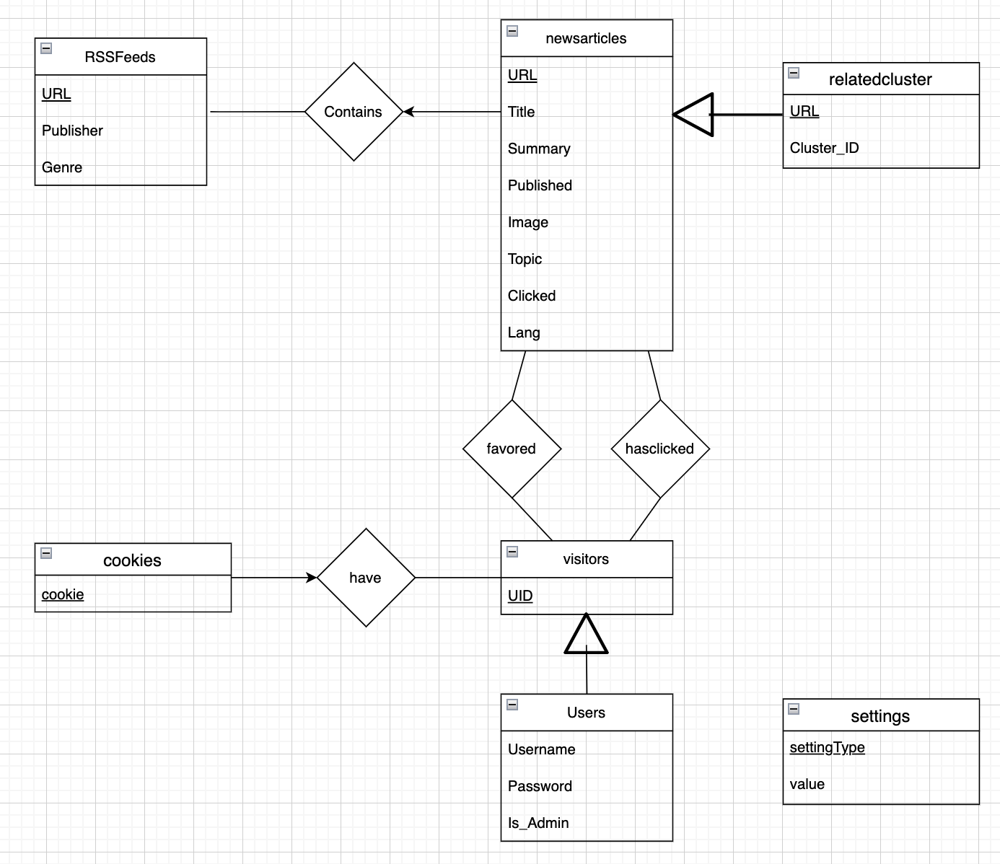

# Database Description




<div style="display: flex; justify-content: space-between;">

<div style="width: 45%;">

**`rssfeeds`**

This table stores information about the different RSS feeds that the system is aggregating. The `URL` is the primary key, meaning it's unique for each RSS feed. The `Publisher` and `Genre` provide more details about the source of the feed.

**`newsarticles`**

This table is the heart of the application. It contains all the news articles fetched from the various RSS feeds. Each article has a unique `URL`, `Title`, `Summary`, `Published` date, an `Image` URL and a `Topic`. The `RSS_URL` is a foreign key linking back to the `rssfeeds` table, so we know which feed an article came from. The `ON DELETE CASCADE` clause ensures that if a feed is deleted, all related articles will also be deleted.

**`relatedcluster`**

This table is used to group similar articles together. It references the `newsarticles` table and assigns a `Cluster_ID` to similar articles. This helps in reducing redundancy and showing only one version of similar articles.

**`visitors`**

This table records all the unique visitors to the website. The `UID` is an automatically incrementing serial number that uniquely identifies each visitor.

</div>

<div style="width: 45%;">

**`users`**

The `users` table contains detailed information about registered users. It includes their `Username`, `Email`, `Password`, and an `Is_Admin` flag to denote admin users. The `UID` is a foreign key linking back to the `visitors` table, making sure every user is also a visitor.

**`cookies`**

The `cookies` table is used for session management. It stores a unique `cookie` for each `UID`, helping in maintaining state between different user sessions.

**`hasclicked`**

The `hasclicked` table is a relation table that tracks which user has clicked on which article. This data is crucial for the recommender system to determine article relevance for each user.

**`favored`**

The `favored` table also relates to users and articles. It keeps track of users' favorite articles. This data could be used to enhance the performance of the recommender system by giving more weight to favored articles.

**`settings`**

Finally, the `settings` table stores different configurable settings for the application. The `settingType` is the primary key and `value` is the value of that setting.

</div>

</div>

These tables help in storing, managing and processing the data needed for running the news aggregator app effectively. The relationships between the tables ensure data integrity and aid in implementing the necessary functionalities of the application.

---
---

# Database Solution

This suite of Python code is designed to provide a comprehensive news aggregator solution with a PostgreSQL database backend. The codebase consists of several modules that enable the initialization of the database, population with RSS feeds, insertion of news articles scraped from the feeds, and retrieval of data from the database. The codebase is modularized, well-documented, and designed to be easily extensible, making it an excellent starting point for a more complex news aggregator solution. With the ability to connect to and interface with the database, this codebase provides a simple but powerful interface to the database, enabling users to define, populate, and query the database with ease.

# Table of Contents

1. [Code Documentation for ui_db.py](#ui_dbpy)

2. [Code Documentation for init_db.py](#init_dbpy)

3. [Code Documentation for populate_db.py](#populate_dbpy)

4. [Code Documentation for Scraper.py](#Scraperpy)

5. [Code Documentation for query_db.py](#querydbpy)

6. [Code Documentation for article_clustering.py](#newsclusterer-technical-documentation)

# ui_db.py

The DBConnection class is an interface for interacting with a PostgreSQL database that contains a newsaggregator schema. It provides methods for establishing a connection to the database, redefining the schema, populating the tables with hardcoded data, retrieving articles and RSS feeds, and performing CRUD operations on users, articles, and RSS feeds. The class also returns the data in JSON format. The class can be imported and instantiated, and its methods can be called to perform operations on the database.

## Class `DBConnection`
### Connection methods

 `__init__(self)`

- This is the constructor of the `DBConnection` class that initializes the `connection` and `cursor` attributes to `None`.

 `__del__(self)`

- This method is called when an object of the `DBConnection` class is deleted and it closes the connection to the database.

 `is_connected(self) -> bool`

- This method checks if the connection to the database exists and returns a boolean value accordingly.

 `connect(self) -> bool`

- This method tries to establish a connection with the database and returns a boolean value indicating whether the connection was successful.

### Database Operations

 `redefine(self)`

- This method recreates the database by dropping and re-creating the schema and tables.

 `populate(self)`

- This method populates the database with hardcoded data by inserting rows into the `rssfeeds` and `newsarticles` tables.

### Articles

 `getArticles(self, tag: str = "") -> json`

- This method retrieves all rows from the `newsarticles` table and returns them as a JSON object.

 `addArticle(self, url: str, title: str, summary: str, published: str, image: str, rss_url: str, topic: str)`

- This method adds an article to the database.

 `deleteArticle(self, url: str)`

- This method deletes an article from the database.

 `updateArticle(self, url: str, title: str, summary: str, published: str, image: str, rss_url: str, topic: str)`

- This method updates an article in the database.

### Users

 `getUsers(self) -> json`

- This method retrieves all rows from the `users` table and returns them as a JSON object.

 `getUser(self, email: str) -> bool`

- This method retrieves a user from the database with a specific email and returns a boolean value indicating whether the user exists. If the user exists, it also returns a dictionary with the user's data.

 `addUser(self, username: str, email: str, password: str, is_admin: bool)`

- This method adds a user to the database.

 `updateUser(self, id:int, username: str, email: str, password: str, is_admin: bool)`

- This method updates a user in the database.

 `deleteUser(self, username: str)`

- This method deletes a user from the database.

### RSS Feeds

 `ParseRSSFeeds(self) -> json`

- This method retrieves all rows from the `rssfeeds` table and returns them as a JSON object.

 `addRSSFeed(self, url: str, publisher: str, topic: str)`

- This method adds an RSS feed to the database.

 `deleteRSSFeed(self, url: str)`

- This method deletes an RSS feed from the database.

 `updateRSSFeed(self, url: str, publisher: str, topic: str)`

- This method updates an RSS feed in the database.


## Example usage

To use the `DBConnection` class, first create an object of this class and call the `connect()` method to establish a connection to the database. Once a connection has been established, call the other methods of this class to perform operations on the database.

```
import Scraper
from ui_db import DBConnection
```

- Create a DBConnection object
```
DB = DBConnection()
```
- Connect to the database
```
DB.connect()
```
- Redefine the database
```
DB.redefine()
```
- Populate the database
```
DB.populate()
```
- Use the scraper to insert new articles into the database
```
Scraper.scraper()
```
- Retrieve articles from the database
```
articles = DB.getArticle()
```
- Retrieve users from the database
```
users = DB.getUsers()
```
- Retrieve RSS feeds from the database
```
rss_feeds = DB.ParseRSSFeeds()
```


# init_db.py

This code is written in Python and uses the psycopg2 library to connect to a PostgreSQL database. The purpose of this code is to initialize a new database and create tables for a news aggregator.

 `initialize_db(cur)`

- This function takes in a cursor object `cur` as a parameter, which is used to execute SQL statements. The function creates a new schema called `newsaggregator` and three tables within it: `rssfeeds`, `newsarticles`, and `users`. It also creates a fourth table called `hasclicked` that stores information about which users have clicked on which articles.

### SQL statements

- The SQL statements that are executed in this function are as follows:

#### `sql1`

- This SQL statement drops any existing schema and tables with the same names as the ones being created. It is necessary to do this to ensure that the database is properly initialized.

#### `sql2`

- This SQL statement creates a new schema called `newsaggregator`.

#### `sql3`

- This SQL statement creates three tables within the `newsaggregator` schema: `rssfeeds`, `newsarticles`, and `users`. It also creates a fourth table called `hasclicked` that stores information about which users have clicked on which articles. Each table has a set of columns with specific data types and constraints.

### Executing SQL statements

The SQL statements are executed using the `execute()` method of the cursor object. Once each SQL statement is executed, a message is printed to the console to indicate which action has been taken.

# populate_db.py

This code is written in Python and uses the psycopg2 and pandas libraries to connect to a PostgreSQL database and read data from a CSV file. The purpose of this code is to populate the `rssfeeds` table in the `newsaggregator` schema with data from a CSV file.

`populate_db(conn, cur)`

- This function takes in a connection object `conn` and a cursor object `cur` as parameters. The `conn` object is used to commit changes to the database, while the `cur` object is used to execute SQL statements. The function reads data from a CSV file called `RSSFeeds.csv` and inserts it into the `rssfeeds` table.

### Reading data from CSV file

The function uses the pandas library to read data from a CSV file called `RSSFeeds.csv`. The CSV file must have three columns: `URL`, `Publisher`, and `Topic`. The function reads the data from each column into separate lists.

### SQL statements

The function uses an SQL statement called `rss_insert_query` to insert data into the `rssfeeds` table. The SQL statement has three parameters, which are filled in with data from the lists created in the previous step.

### Executing SQL statements

The SQL statement is executed using the `execute()` method of the cursor object. The function iterates through each row of the CSV file and inserts the data into the `rssfeeds` table one row at a time. After each row is inserted, the changes are committed to the database.

# Scraper.py

This code is written in Python and uses the feedparser library to scrape RSS feeds and the psycopg2 library to connect to a PostgreSQL database. The purpose of this code is to scrape news articles from RSS feeds and insert them into the `newsarticles` table in the `newsaggregator` schema of the database.

`scraper()`

- This function scrapes news articles from RSS feeds and inserts them into the `newsarticles` table in the database. It does this by iterating through each RSS feed in the `rssfeeds` table of the database and using the feedparser library to scrape news articles from each feed. The function then inserts the scraped data into the `newsarticles` table.

### Initializing DB object

The function creates a DBConnection object called `DB` to connect to the database. The `DBConnection()` function is defined in another file called `ui_db.py`. 

### Parsing RSS feed info

The function calls the `ParseRSSFeeds()` method of the `DB` object to retrieve the RSS feed information from the `rssfeeds` table. The method returns a JSON object, which is converted to a Python dictionary using the `json.loads()` method. 

### Scraping news articles

The function iterates through each RSS feed in the dictionary and uses the `feedparser.parse()` method to scrape news articles from the feed. The function extracts information about each article, including its URL, title, summary, published date, and image URL. It then uses an SQL statement called `rss_insert_query` to insert the data into the `newsarticles` table.

### Executing SQL statements

The SQL statement is executed using the `execute()` method of the cursor object. If an exception is raised during the execution, it means that the article is most likely a duplicate and is not inserted. After each row is inserted, the changes are committed to the database.

### Example usage

To use this function, you must first ensure that the database has been initialized and the `rssfeeds` table has been populated with data using the `initialize_db()` and `populate_db()` functions respectively. Then, call the `scraper()` function to start scraping news articles from the RSS feeds and inserting them into the `newsarticles` table.

```python
scraper()
```

# query_db.py

This code is written in Python and uses the psycopg2 library to generate SQL statements that interact with the `newsaggregator` schema of a PostgreSQL database. The purpose of this code is to define functions that return SQL statements for inserting, updating, deleting or retrieving data from the `rssfeeds`, `newsarticles`, and `users` tables in the schema.

`insert_rssfeed(URL: str, Publisher: str, Topic: str) -> str`

- This function takes in three parameters representing the URL, publisher, and topic of an RSS feed and returns an SQL statement for inserting this information into the `rssfeeds` table.

`insert_newsarticle(URL: str, Title: str, Summary: str, Published: str, Image_URL: str, RSS_URL: str, Topic: str) -> str`

- This function takes in seven parameters representing the URL, title, summary, published date, image URL, RSS URL, and topic of a news article and returns an SQL statement for inserting this information into the `newsarticles` table.

`insert_user(Username: str, Email: str, Password: str, Is_Admin: bool) -> tuple()`

- This function takes in four parameters representing the username, email, password, and administrative status of a user and returns a tuple with the SQL statement for inserting this information into the `users` table and the parameters for the query.

`delete_rssfeed(URL: str) -> str`

- This function takes in the URL of an RSS feed and returns an SQL statement for deleting the corresponding row from the `rssfeeds` table.

`delete_newsarticle(URL: str) -> str`

- This function takes in the URL of a news article and returns an SQL statement for deleting the corresponding row from the `newsarticles` table.

`delete_user(Uid: str) -> str`

- This function takes in the UID of a user and returns an SQL statement for deleting the corresponding row from the `users` table.

`update_rssfeed(URL: str, Publisher: str, Topic: str) -> str`

- This function takes in three parameters representing the URL, publisher, and topic of an RSS feed and returns an SQL statement for updating this information in the corresponding row of the `rssfeeds` table.

`update_newsarticle(URL: str, Title: str, Summary: str, Published: str, Image_URL: str, RSS_URL: str, Topic: str) -> str`

- This function takes in seven parameters representing the URL, title, summary, published date, image URL, RSS URL, and topic of a news article and returns an SQL statement for updating this information in the corresponding row of the `newsarticles` table.

`update_user(ID: int, Username: str, Email: str, Password: str, Is_Admin: bool) -> str`

- This function takes in five parameters representing the UID, username, email, password, and administrative status of a user and returns an SQL statement for updating this information in the corresponding row of the `users` table.

`get_rssfeeds() -> str`

- This function returns an SQL statement for retrieving all rows from the `rssfeeds` table.

`get_newsarticles() -> str`

- This function returns an SQL statement for retrieving all rows from the `newsarticles` table.

`get_users() -> str`

- This function returns an SQL statement for retrieving all rows from the `users` table.

`get_user(email: str) -> str`

- This function takes in an email address and returns an SQL statement for retrieving the corresponding row from the `users` table.

### Executing SQL statements

The SQL statements are not executed in this code. Instead, they are returned as strings and can be executed using the `execute()` method of a cursor object.

---

# NewsClusterer Technical Documentation

The `NewsClusterer` class clusters news articles based on their titles and summaries. The clustering process consists of:

1. Text preprocessing with `preprocess_text()`
2. Vectorizing text and applying dimensionality reduction using TF-IDF and SVD within `process_data()`
3. Clustering using DBSCAN in `cluster_data()`

## 1. Text Preprocessing

`preprocess_text()` 
The first step in the pipeline is to preprocess the text data. This process includes:

- HTML tag removal: HTML tags are removed using the BeautifulSoup library.
- Tokenization: The text is split into individual words (tokens) using the NLTK library.
- Stop word removal: Common words (e.g., "the", "and") are removed to reduce noise and improve computational efficiency.
- Lemmatization: Words are converted to their base form (e.g., "running" -> "run") to reduce dimensionality and improve similarity calculations.

This results in a cleaner and more compact representation of the text, making it easier for subsequent algorithms to process.


## 2. Vectorizing Text and Dimensionality Reduction

`process_data()` converts preprocessed text into numerical vectors using the Term Frequency-Inverse Document Frequency (TF-IDF) technique. TF-IDF is chosen as it captures the importance of each word in the document, while taking into account the overall frequency of the word in the dataset.

$$
\text{tfidf}(t, d, D) = \text{tf}(t, d) \times \text{idf}(t, D)
$$

where $\text{tf}(t, d)$ is the term frequency of term $t$ in document $d$, $\text{idf}(t, D)$ is the inverse document frequency of term $t$ in the set of documents $D$, and $D$ is the total number of documents. The inverse document frequency is calculated as:

$$
\text{idf}(t, D) = \log{\frac{N}{\text{df}(t)}}
$$

where $N$ is the total number of documents, and $\text{df}(t)$ is the number of documents containing term $t$.


Next, `process_data()` applies Singular Value Decomposition (SVD) to the TF-IDF matrix to reduce the feature space. SVD is used because it can efficiently compress information while maintaining the relationships among the documents.

$$
X_{reduced} = U \times \Sigma \times V^{T}
$$

where $X_{reduced}$ is the reduced feature matrix, $U$ contains the left singular vectors, $\Sigma$ is a diagonal matrix with singular values, and $V^{T}$ contains the right singular vectors.

## 3. Clustering Articles

`cluster_data()` uses the DBSCAN algorithm to cluster articles based on the reduced feature matrix. DBSCAN is chosen as it can automatically determine the number of clusters and is robust to noise, which helps reduce the impact of irrelevant articles or outliers.

```math
\text{DBSCAN}(P, \epsilon, \text{min\_samples})
```

DBSCAN has two main parameters that can be tweaked to improve performance:

- $\epsilon$: The maximum distance between two points for them to be considered as part of the same cluster. A smaller value will result in more clusters, while a larger value will result in fewer clusters.
- min\_samples: The minimum number of points required to form a dense region. A higher value will make the algorithm more conservative in forming clusters, while a lower value will create more clusters.

## Visualizing Clusters

`visualize_clusters()` uses the t-SNE algorithm for 3D visualization of the clusters. t-SNE is suitable for visualizing high-dimensional data in lower-dimensional spaces, providing an intuitive understanding of the clustering results.

$$
\text{t-SNE}(X_{reduced}, d)
$$

In summary, the `NewsClusterer` class provides a concise pipeline for clustering news articles based on their titles and summaries, with dimensionality reduction and 3D visualization of the resulting clusters. The DBSCAN parameters can be adjusted to optimize the clustering performance.


